<div align="center">

  <!-- HERO SECTION BANNER -->
  <a href="https://github.com/Snigdha-2005">
    
  </a>

  <!-- Animated Divider -->
  

</div>

<!-- TERMINAL STATUS CARD -->
<div align="center">
  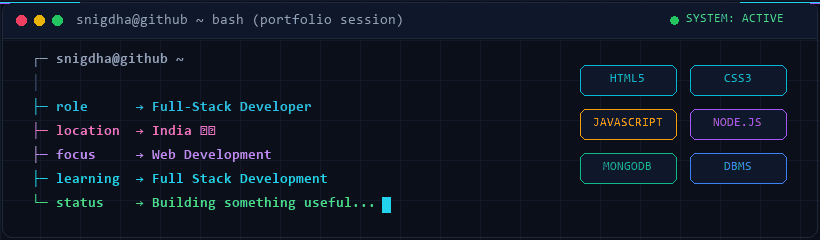
</div>

<details>
<summary><b>📋 View Terminal Status Card (Raw Text)</b></summary>

```text
┌─ snigdha@github ~
│
├─ role      → Full-Stack Developer
├─ location  → India
├─ focus     → Web Development
├─ learning  → Full Stack Development
└─ status    → Building something useful...
```

</details>

<div align="center">
  
</div>

<!-- 2. PROFILE INTRO -->
## 🧭 About Me

<!-- Animated About Me Card -->
<div align="center">
  
</div>

<details>
<summary><b>📋 View About Me (Raw Text)</b></summary>

> I'm **Snigdha Das**, a passionate full-stack developer from India who enjoys turning ideas into practical web applications.

Focused on the complete lifecycle of modern software:
* 🌐 **Frontend Development** — Structuring semantic interfaces and engaging user experiences
* ⚙️ **Backend Development** — Building organized servers and RESTful endpoints
* 🗄️ **Databases** — Designing resilient schemas and managing structured data stores
* 📐 **Web Application Architecture** — Connecting interfaces, APIs, and persistence layers seamlessly
* 🚀 **Continuous Learning** — Constantly leveling up engineering foundations and adopting best practices

</details>

<div align="center">
  
</div>

<!-- 3. CURRENT PROJECT -->
## 🚧 Currently Building

### 📚 [Full-Stack Library Management](https://github.com/Snigdha-2005/Full-Stack-Library-Management)

> A full-stack web application focused on managing library-related operations through a structured web interface.

<!-- Animated Architecture Flow Pipeline -->
<div align="center">
  <a href="https://github.com/Snigdha-2005/Full-Stack-Library-Management">
    
  </a>
</div>

<details>
<summary><b>🔍 View Pipeline Text Flowchart</b></summary>

```text
Frontend
   ↓
Web Interface
   ↓
Backend / API
   ↓
Database
   ↓
Library Management
```

</details>

<br/>

<!-- Animated Project Repository & Focus Card -->
<div align="center">
  <a href="https://github.com/Snigdha-2005/Full-Stack-Library-Management">
    
  </a>
</div>

<details>
<summary><b>📋 View Project Details (Raw Text)</b></summary>

* **Core Focus:** Clean separation of concerns between client views, backend routing, and database records.
* **Repository:** [github.com/Snigdha-2005/Full-Stack-Library-Management](https://github.com/Snigdha-2005/Full-Stack-Library-Management)

</details>

<div align="center">
  
</div>

<!-- 4. TECH STACK -->
## ⚡ Tech Stack

<!-- Animated Tech Stack Dashboard -->
<div align="center">
  
</div>

<br/>

<!-- Shields Badges -->
<p align="center">
  
  
  
  &nbsp;•&nbsp;
  
  &nbsp;•&nbsp;
  
  
</p>

<div align="center">
  
</div>

<!-- 5. DEVELOPER TERMINAL -->
## 🖥️ Developer Terminal

<div align="center">
  
</div>

<br/>

<details>
<summary><b>🔍 View Raw Terminal Text Output</b></summary>

```bash
$ whoami

snigdha-das

$ skills

HTML
CSS
JavaScript
DBMS
MongoDB
Node.js

$ current_project

Full-Stack-Library-Management

$ learning

Full Stack Development

$ status

Building...
```

</details>

<div align="center">
  
</div>

<!-- 6. CURRENTLY LEARNING -->
## 🌱 Currently Learning

**Full-Stack Development**

<!-- Animated Learning Pipeline -->
<div align="center">
  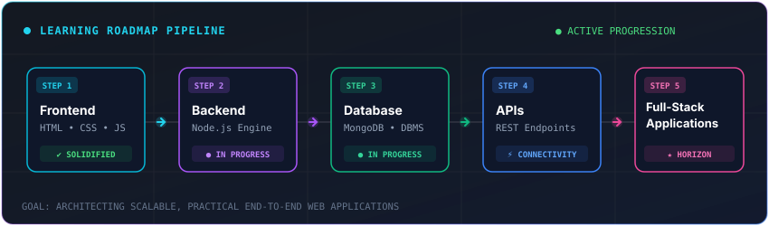
</div>

<details>
<summary><b>🔍 View Learning Roadmap Flowchart</b></summary>

```text
Frontend
   ↓
Backend
   ↓
Database
   ↓
APIs
   ↓
Full-Stack Applications
```

</details>

<br/>

Actively exploring how modern full-stack systems interconnect: from stateful client interfaces and RESTful route orchestration to database index optimization and data persistence patterns.

<div align="center">
  
</div>

<!-- 7. GITHUB STATISTICS -->
## 📊 GitHub Analytics

<div align="center">
  <a href="https://github.com/Snigdha-2005">
    
  </a>
  &nbsp;
  <a href="https://github.com/Snigdha-2005">
    
  </a>
</div>

<div align="center">
  <a href="https://github.com/Snigdha-2005">
    
  </a>
</div>

<div align="center">
  
</div>

<!-- 8. CONTRIBUTION ACTIVITY -->
## 📈 Contribution Activity

<!-- Animated Contribution Flow Pipeline -->
<div align="center">
  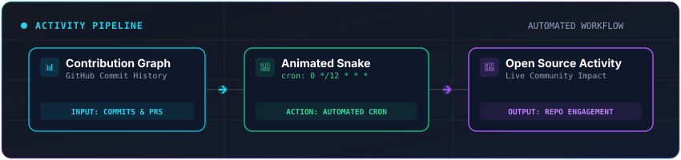
</div>

<br/>

<!-- Animated Contribution Grid Snake Matrix -->
<div align="center">
  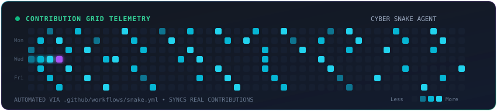
</div>

<details>
<summary><b>🔍 View Contribution Flow Text & Action Status</b></summary>

```text
Contribution Graph
        ↓
Animated Snake
        ↓
Open Source Activity
```

*Configured via `.github/workflows/snake.yml` to automatically trace contribution streaks.*

</details>

<div align="center">
  
</div>

<!-- 9. DEVELOPER MINDSET -->
## 🧠 Developer Mindset

<!-- Animated Mindset Card -->
<div align="center">
  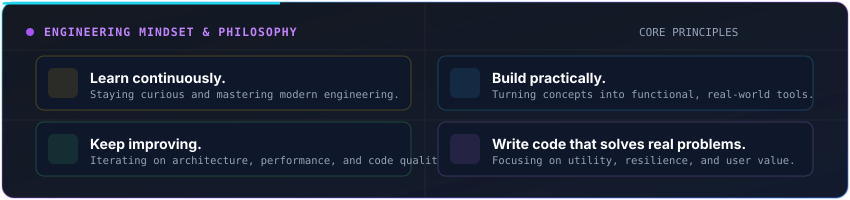
</div>

<details>
<summary><b>📋 View Mindset Principles (Text)</b></summary>

> ⚡ **Learn continuously.**  
> 🔨 **Build practically.**  
> 📈 **Keep improving.**  
> 💡 **Write code that solves real problems.**  

</details>

<div align="center">
  
</div>

<!-- 10. PROFILE FOOTER -->
<div align="center">

  <!-- Animated Footer Card -->
  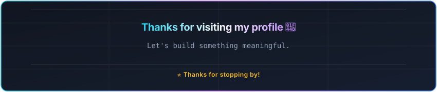

  <br/><br/>
  

</div>
